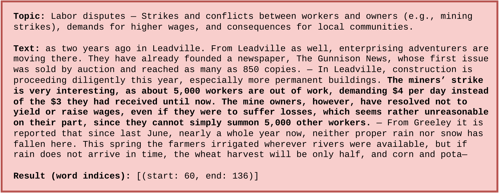

# CzechTopic

CzechTopic is a benchmark dataset of historical Czech documents designed for topic localization and document classification in a zero-shot setting.

## Example topic and text with annotation

<p align="center">
  
</p>

## News

|   |    |
|----------|-----------------------------------|
| **May. 15th, 2026**     | CzechTopic paper has been accepted to ICDAR 2026. |
| **Mar. 4th, 2026**      | The CzechTopic has been published. |


## Overview

CzechTopic is a benchmark dataset of historical Czech documents designed for topic localization and document classification in a zero-shot setting. Each document contains 768–1024 characters and is written in Czech.

The dataset consists of two parts: a development set and a test set. The development set contains 15,245 documents and 19,107 topics. Each topic is annotated in 10 documents. The annotations for the development set were generated using the GPT-5-2-mini model. The test set contains 525 documents and 364 human-created topics, with each topic annotated in five documents. All annotations are provided as character spans, indicating the exact locations in the text where a topic appears.

The evaluation is done at two levels: text level and word level. At the text level, the task is to determine whether a given topic is present in a document. At the word level, the task is to identify which words correspond to a given topic.

## Download

The dataset is publicly available at [Zenodo](https://zenodo.org/records/18877204).

## Evaluation

Evaluation can be performed using the `/evaluation/evaluate.py` script with the following parameters:
- `--pred`: Path to a JSON file containing predictions.
- `--gt`: Path to a directory containing the CzechTopic dataset.
- `--n-boot` [optional]: Number of bootstrap samples.
- `--seed` [optional]: Random seed.
- `--save-path` [optional]: Path to a csv file where results will be saved.

## Paper

**CzechTopic: A Benchmark for Zero-Shot Topic Localization in Historical Czech Documents**

- Martin Kostelník (ikostelnik@fit.vut.cz)
- Michal Hradiš (ihradis@fit.vut.cz)
- Martin Dočekal (idocekal@fit.vut.cz)

ArXiv link: [Arxiv](https://arxiv.org/abs/2603.03884)

**Citation:**

```
@article{kostelnik2026czechtopic,
  title={CzechTopic: A Benchmark for Zero-Shot Topic Localization in Historical Czech Documents},
  author={Kosteln{\'\i}k, Martin and Hradi{\v{s}}, Michal and Do{\v{c}}ekal, Martin},
  journal={arXiv preprint arXiv:2603.03884},
  year={2026}
}

```
